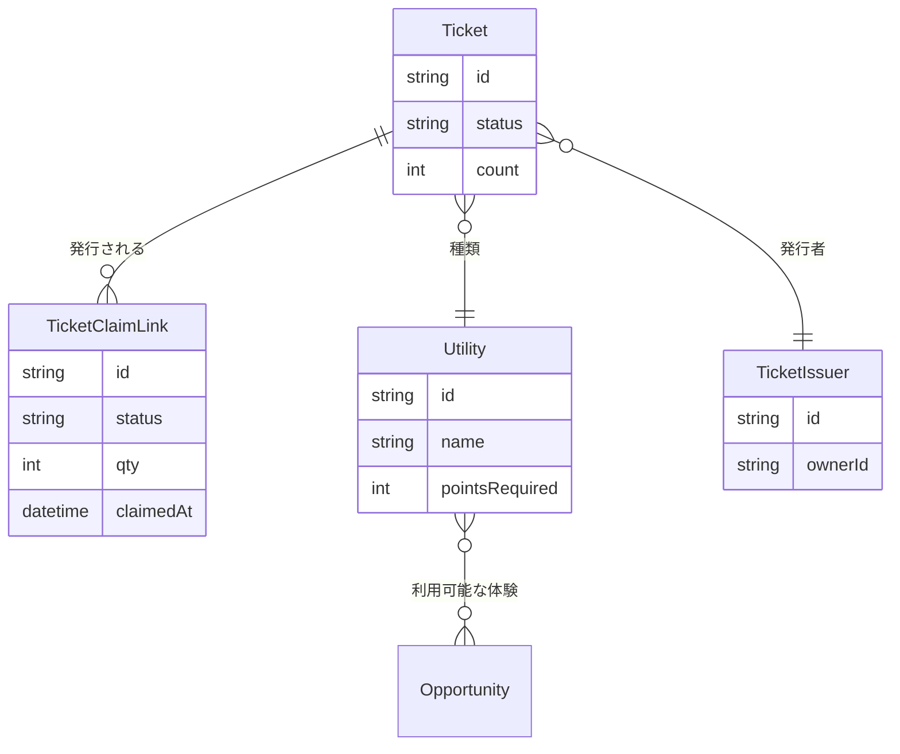
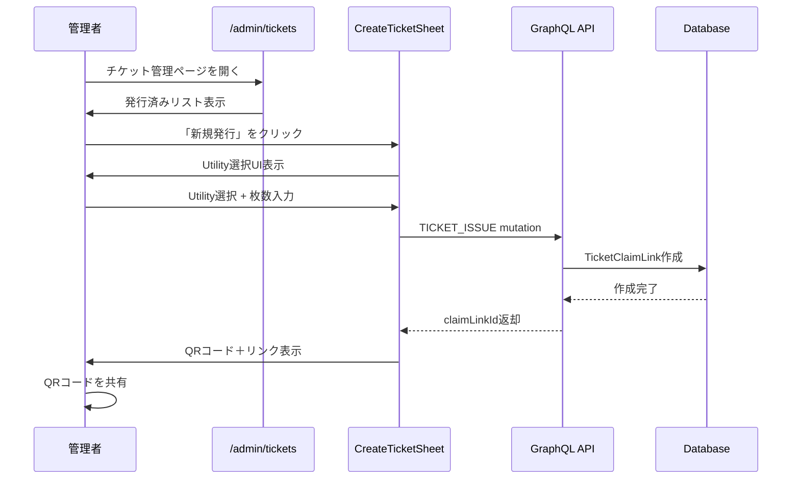
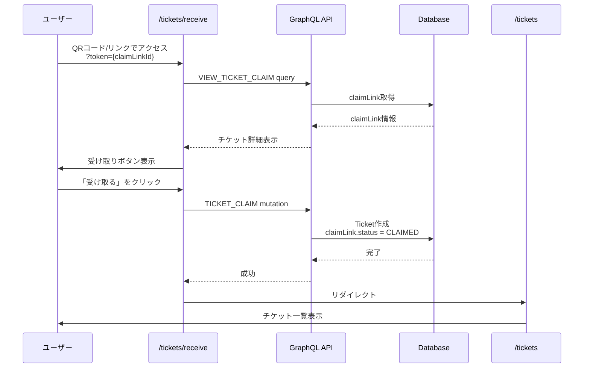
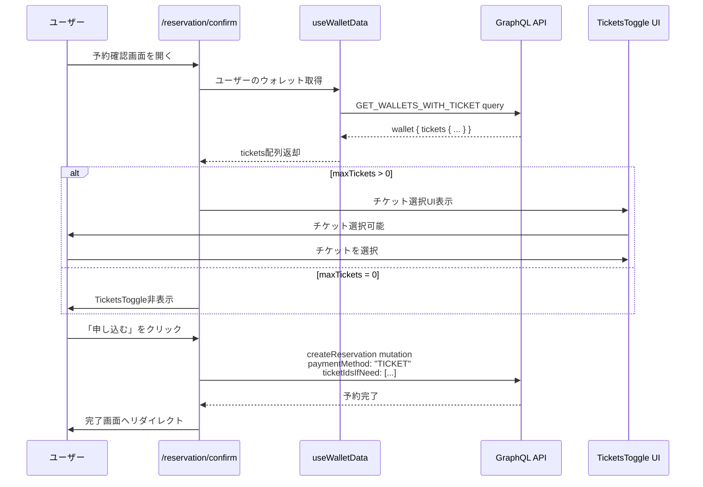
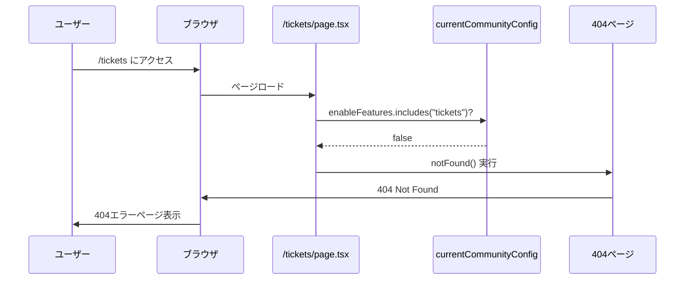
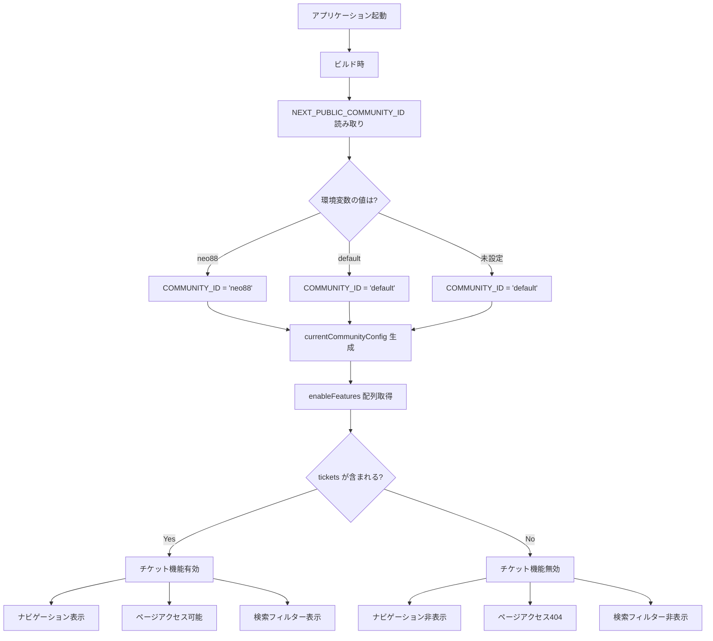
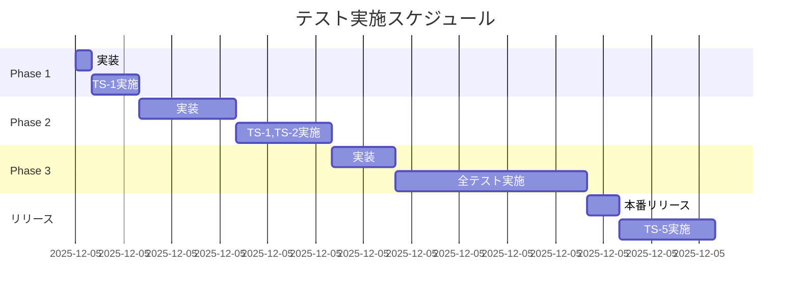

# チケット機能停止 要件定義書

**Document Version:** 1.1
**作成日:** 2025-12-05
**最終更新:** 2025-12-05
**ステータス:** Ready for Review
**レビュー対応:** 専門的レビュー指摘事項を完全反映

---

## 📋 目次

1. [概要](#概要)
2. [コードベースの前提条件](#コードベースの前提条件)
3. [調査結果サマリー](#調査結果サマリー)
4. [目的とスコープ](#目的とスコープ)
5. [現状分析](#現状分析)
6. [システムフロー図](#システムフロー図)
7. [要件定義](#要件定義)
8. [実装計画](#実装計画)
9. [テスト計画](#テスト計画)
10. [リスクと対策](#リスクと対策)
11. [付録](#付録)

---

## 概要

### 背景

civicship-portalにおけるチケット関連機能を全面的に停止する。対象コミュニティは `neo88` と `default` の2つ。

### 影響範囲

- ユーザー向けチケット機能（受け取り、一覧、使用）
- 管理者向けチケット管理機能（発行、Utility管理）
- 予約システムとの統合機能（チケット支払い）
- 検索機能のチケットフィルター

### ビジネス目標

- 使用しない機能の非表示によるユーザー体験の明確化
- 不要な機能の保守コスト削減
- 将来の再有効化を容易にする設計の維持

---

## コードベースの前提条件

> **💡 レビュアー向け**: このセクションでは、チケット機能停止の実装に必要な技術的前提知識を説明します。

### 1. Next.js App Router の構成

#### Server Component と Client Component

このプロジェクトは **Next.js 13+ App Router** を使用しています。

**基本原則:**
```typescript
// Server Component (デフォルト)
// - サーバー側でのみ実行される
// - 環境変数、データベースに直接アクセス可能
// - useState, useEffect などのフックは使用不可

export default function ServerPage() {
  const config = currentCommunityConfig; // ✅ ビルド時に評価
  return <div>{config.title}</div>;
}

// Client Component ("use client" ディレクティブ)
// - ブラウザで実行される
// - インタラクティブな機能が必要な場合に使用
// - useState, useEffect などのフックが使用可能

"use client";
export default function ClientPage() {
  const [count, setCount] = useState(0); // ✅ OK
  return <button onClick={() => setCount(count + 1)}>{count}</button>;
}
```

**本プロジェクトの重要な構成:**

| ページ/コンポーネント | タイプ | 理由 |
|-------------------|--------|------|
| `/tickets/page.tsx` | Server | 静的なチケット一覧表示 |
| `/tickets/receive/page.tsx` | Server | チケット受け取りページ |
| `/admin/tickets/page.tsx` | Server | 管理画面チケット一覧 |
| `/reservation/confirm/page.tsx` | **Client** | GraphQLクエリ、状態管理が必要 |
| `TicketsToggle.tsx` | Client | インタラクティブなUI |
| `SearchFilters.tsx` | Client | フォーム操作が必要 |

**✅ 重要な結論:**
- **`/reservation/confirm` は全体が Client Component** のため、レビュー指摘の「Server で feature flags を集約して Client に渡す」は不要
- `currentCommunityConfig` を Client Component で直接インポートしても問題なし（ビルド時に値が埋め込まれるため）

---

### 2. コミュニティ設定システム

#### 環境変数によるコミュニティ判定

**仕組み:**
```typescript
// /src/lib/communities/metadata.ts

// ステップ1: 環境変数から読み取り
export function getCommunityIdFromEnv(): string {
  const communityId = process.env.NEXT_PUBLIC_COMMUNITY_ID;
  if (!communityId) return "default";
  return communityId;
}

// ステップ2: ビルド時に評価される
export const COMMUNITY_ID = getCommunityIdFromEnv();

// ステップ3: 設定オブジェクトを取得
export const currentCommunityConfig = COMMUNITY_BASE_CONFIG[COMMUNITY_ID];
```

**動作タイミング:**
```
ビルド時 (next build)
  ↓
process.env.NEXT_PUBLIC_COMMUNITY_ID を読み取り
  ↓
COMMUNITY_ID が "neo88" または "default" に固定される
  ↓
ビルド成果物に値が埋め込まれる
  ↓
ランタイム (next start)
  ↓
値は変更されない（静的）
```

**✅ 重要な結論:**
- コミュニティIDは **ビルド時に固定**
- URL、Cookie、サブドメインによる**動的切り替えは存在しない**
- レビュー指摘の「動的コミュニティ対応」の懸念は**該当しない**

---

### 3. フィーチャーフラグシステム

#### enableFeatures 配列の仕組み

**定義:**
```typescript
type FeaturesType =
  | "places"
  | "opportunities"
  | "points"
  | "tickets"  // ← 今回削除対象
  | "articles"
  | "prefectures"
  | "credentials"
  | "justDaoIt"
  | "quests"
  | "languageSwitcher";

interface CommunityBaseConfig {
  id: string;
  enableFeatures: FeaturesType[]; // ← ここで制御
  // ...
}
```

**現在の設定:**
```typescript
const COMMUNITY_BASE_CONFIG = {
  neo88: {
    enableFeatures: [
      "opportunities",
      "points",
      "articles",
      "tickets",      // ← 有効
      "prefectures",
      "quests"
    ],
  },
  default: {
    enableFeatures: [
      "opportunities",
      "places",
      "points",
      "articles",
      "tickets",      // ← 有効
      "prefectures",
      "quests"
    ],
  },
  "himeji-ymca": {
    enableFeatures: [
      "opportunities",
      "points",
      "articles",
      // "tickets" なし ← すでに無効
      "prefectures"
    ],
  },
};
```

**使用パターン:**
```typescript
// パターン1: 条件付きレンダリング
{currentCommunityConfig.enableFeatures.includes("tickets") && (
  <TicketTab />
)}

// パターン2: 早期リターン
if (!currentCommunityConfig.enableFeatures.includes("tickets")) {
  return null;
}

// パターン3: 404エラー
if (!currentCommunityConfig.enableFeatures.includes("tickets")) {
  notFound();
}
```

---

### 4. GraphQL とデータフロー

#### Apollo Client の使用

**クエリの定義:**
```typescript
// /src/graphql/account/wallet/query.ts
export const GET_WALLETS_WITH_TICKET = gql`
  query GetWalletsWithTicket($filter: WalletFilterInput, ...) {
    wallets(filter: $filter, ...) {
      edges {
        node {
          ...WalletFields
          tickets {              # ← チケットフィールド
            ...TicketFields
            utility {
              ...UtilityFields
            }
          }
        }
      }
    }
  }
`;
```

**使用箇所:**
```typescript
// /src/app/reservation/confirm/hooks/useWalletData.ts
export function useWalletData(userId?: string) {
  const { data, loading } = useGetWalletsWithTicketQuery({
    variables: { filter: { userId, ... } },
  });

  const tickets: GqlTicket[] = useMemo(
    () => wallets?.[0]?.tickets ?? [],
    [wallets]
  );

  return { tickets, ... };
}
```

**✅ 重要な結論:**
- チケット機能を無効化しても、**GraphQL クエリは tickets フィールドを取得し続ける**
- API 側は削除しないため、エラーは出ない
- ただし、**不要なデータを取得するオーバーヘッドが発生**
- 再有効化を想定するなら、クエリはそのまま残すのが推奨

---

### 5. 予約システムの構成

#### 支払い方法の種類

予約システムは **3つの支払い方法** をサポート:

```typescript
enum PaymentMethod {
  CASH = "現金",
  POINTS = "ポイント",
  TICKET = "チケット"  // ← 今回無効化対象
}
```

**予約フロー:**
```
1. Opportunity (体験) を選択
   ↓
2. Slot (日時) を選択
   ↓
3. 予約確認画面 (/reservation/confirm)
   ↓
4. 支払い方法を選択
   - ポイント利用 (usePoints: boolean)
   - チケット利用 (useTickets: boolean)
   ↓
5. 予約作成 (createReservation mutation)
   - paymentMethod: "TICKET"
   - ticketIdsIfNeed: string[]
```

**maxTickets の計算:**
```typescript
// /src/app/reservation/confirm/utils/reservationCalculations.ts
const availableTicketCount = wallet?.tickets.filter(
  ticket => ticket.utility?.requiredForOpportunityIds?.includes(opportunityId)
).length ?? 0;

const maxTickets = Math.min(availableTicketCount, participantCount);
```

**条件付きレンダリング:**
```typescript
// /src/app/reservation/confirm/components/payment/PaymentSection.tsx
{maxTickets > 0 && (
  <TicketsToggle ... />  // ← maxTickets = 0 なら非表示
)}
```

**✅ 重要な結論:**
- チケット機能を無効化すると、`maxTickets = 0` になる
- 既存の条件分岐により、**自動的に TicketsToggle が非表示**
- ただし、GraphQL クエリは引き続き tickets を取得

---

### 6. 検索システムの構成

#### URL パラメータとフィルター

**フローチェーン:**
```
1. SearchFilters.tsx
   ↓ useTicket: boolean
2. useSearchForm hook
   ↓ フォーム状態管理
3. buildSearchResultParams()
   ↓ useTicket → ticket=1
4. URL: /search/result?ticket=1
   ↓
5. result/page.tsx
   ↓ searchParams.get("ticket")
6. useSearchResults hook
   ↓ filter.isReservableWithTicket = true
7. GraphQL クエリ実行
```

**実装詳細:**
```typescript
// /src/app/search/data/presenter.ts
export function buildSearchResultParams(
  q: string,
  location: string,
  dateRange: DateRange | undefined,
  guests: number,
  useTicket: boolean,  // ← ここから
  usePoints: boolean,
  type: "activity" | "quest",
): URLSearchParams {
  const params = new URLSearchParams();
  if (useTicket) params.set("ticket", "1");  // ← ここへ
  // ...
}

// /src/app/search/result/hooks/useSearchResults.ts
if (searchParams.ticket === "1") {
  filter.isReservableWithTicket = true;  // ← GraphQL フィルタ
}
```

**✅ 重要な結論:**
- 検索フィルターは **複数のレイヤー** で連携
- チケット機能無効化には、**SearchFilters.tsx での条件付きレンダリング** が必要
- URL パラメータ `ticket=1` が渡されても、フィルターUIが非表示なら問題なし

---

## 調査結果サマリー

### コードベース調査で判明した事実

| 項目 | 調査結果 | 影響 |
|------|---------|------|
| **コミュニティ判定** | 環境変数 `NEXT_PUBLIC_COMMUNITY_ID` で静的決定 | 動的切り替えの懸念は不要 |
| **currentCommunityConfig** | ビルド時に固定、ランタイム変更なし | Server/Client の区別は不要 |
| **GraphQL クエリ** | `GET_WALLETS_WITH_TICKET` で tickets 取得 | 無効化後も取得し続ける |
| **予約画面構成** | 全体が Client Component | Server での props 渡し不要 |
| **検索フィルター** | 5つのレイヤーで連携 | SearchFilters.tsx で制御 |

### レビュー指摘への対応

#### ✅ 指摘1: currentCommunityConfig の動的性

**指摘内容:**
> コミュニティ選択が URL/Cookie/ドメインによる切り替えなら、Server Component でリクエストごとの Context を読む必要がある

**調査結果:**
- コミュニティIDは環境変数 `NEXT_PUBLIC_COMMUNITY_ID` で決定
- ビルド時に固定され、ランタイム変更なし

**結論:** ✅ この懸念は該当しない

---

#### ✅ 指摘2: Client Component での feature flag の扱い

**指摘内容:**
> `currentCommunityConfig` を直接 import すると、ビルド時の値が固定される可能性

**調査結果:**
- `/reservation/confirm/page.tsx` は全体が Client Component
- `NEXT_PUBLIC_` 環境変数はビルド時に埋め込まれる（意図された動作）

**結論:** ✅ 直接 import しても問題なし

---

#### ✅ 指摘3: GraphQL フィールドの最適化

**指摘内容:**
> 予約確認の GraphQL 取得で Ticket フィールドを取得している可能性

**調査結果:**
- `GET_WALLETS_WITH_TICKET` で `tickets { ...TicketFields }` を取得
- チケット機能無効化後も取得し続ける

**対応方針:**
- **再有効化を想定するため、クエリは変更しない**
- UI 非表示により、データは使用されない
- パフォーマンス影響は軽微（tickets は通常0-10件程度）

**結論:** ✅ クエリは現状維持（ドキュメントに明記）

---

#### ✅ 指摘4: 検索フィルターの実装箇所

**指摘内容:**
> "該当箇所調査" が未完了。後回しにするとバグにつながる

**調査結果:**
- 修正箇所: `SearchFilters.tsx` (94-115行目)
- 条件: `currentCommunityConfig.enableFeatures.includes("tickets")`

**対応方針:**
- Phase 3 で `SearchFilters.tsx` を修正
- 条件付きレンダリングで "その他の条件" セクション全体を制御

**結論:** ✅ 実装箇所を特定済み

---

## 目的とスコープ

### 主目的

チケット関連機能を完全に無効化し、ユーザー・管理者ともにアクセスできないようにする

### 副次的目的

- コードベースの簡素化
- 不要な機能の保守コスト削減
- ユーザー体験の明確化（使用しない機能の非表示）

### 非目的

- チケット関連データの削除（将来の再有効化の可能性を残す）
- GraphQL APIエンドポイントの削除
- データベーススキーマの変更
- GraphQL クエリからの tickets フィールド削除（再有効化を容易にするため）

### スコープ

#### 実装対象 (In Scope)

**Phase 1: フィーチャーフラグの無効化**
- コミュニティ設定からの `"tickets"` フィーチャー削除
- ナビゲーション要素の自動非表示

**Phase 2: ページレベルのアクセス制御**
- ユーザー向けチケットページのアクセス制限（404）
- 管理画面チケットページのアクセス制限（404）

**Phase 3: 統合機能の無効化**
- 検索フィルターからのチケット関連項目削除

#### 実装対象外 (Out of Scope)

- データベースからのチケットデータ削除
- GraphQL APIの削除
- バックエンドロジックの削除
- GraphQL クエリの tickets フィールド削除
- 他のコミュニティ（既に無効化済み）の設定変更
- 予約確認画面の TicketsToggle コンポーネント修正（maxTickets=0 で自動非表示）

---

## 現状分析

### チケット機能の構成要素

#### データモデル



#### ページ構成

**ユーザー向け:**
- `/tickets` - チケット一覧ページ
- `/tickets/receive` - チケット受け取りページ

**管理者向け:**
- `/admin/tickets` - チケット管理ページ
- `/admin/tickets/[id]` - チケット詳細ページ
- `/admin/tickets/utilities` - Utility管理ページ

#### 主要コンポーネント

| コンポーネント | パス | タイプ | 用途 |
|--------------|------|--------|------|
| `TicketList` | `/src/app/tickets/components/TicketList.tsx` | Client | チケット一覧表示 |
| `TicketReceiveContent` | `/src/app/tickets/receive/components/TicketReceiveContent.tsx` | Client | チケット受け取りUI |
| `CreateTicketSheet` | `/src/app/admin/tickets/components/CreateTicketSheet.tsx` | Client | チケット発行UI |
| `TicketsToggle` | `/src/app/reservation/confirm/components/payment/TicketsToggle.tsx` | Client | 予約時のチケット選択 |
| `UserTicketsAndPoints` | `/src/app/users/features/profile/components/UserTicketsAndPoints.tsx` | Client | プロフィールのチケット表示 |
| `SearchFilters` | `/src/app/search/components/SearchFilters.tsx` | Client | 検索フィルター |

#### フィーチャーフラグ制御箇所

| ファイル | 行番号 | 制御内容 | 動作 |
|---------|--------|---------|------|
| `AdminBottomBar.tsx` | 53-60 | 管理画面ナビゲーションタブ | ✅ 自動非表示 |
| `UserTicketsAndPoints.tsx` | 61-65 | プロフィールページのチケット表示 | ✅ 自動非表示 |
| `admin/page.tsx` | 37-42, 76-80 | 管理設定ページのリンク | ✅ 自動非表示 |

#### GraphQL API

**クエリ:**
- `GET_TICKETS` - チケット一覧取得
- `VIEW_TICKET_CLAIM_LINKS` - チケットクレームリンク取得
- `GET_TICKET_ISSUERS` - 発行者情報取得
- `GET_UTILITIES` - Utility一覧取得
- `GET_WALLETS_WITH_TICKET` - ウォレット＋チケット取得（予約確認画面で使用）

**ミューテーション:**
- `TICKET_ISSUE` - チケット発行
- `TICKET_CLAIM` - チケット受け取り
- `CREATE_UTILITY` - Utility作成
- `createReservation` (チケット使用含む) - 予約作成

---

## システムフロー図

### チケット発行フロー（現状）



### チケット受け取りフロー（現状）



### チケット使用フロー（予約時・現状）



### 無効化後のページアクセスフロー



### フィーチャーフラグチェックフロー



### 検索フィルターのデータフロー

```mermaid
graph LR
    A[SearchFilters UI] -->|useTicket: boolean| B[useSearchForm hook]
    B -->|フォーム状態| C[buildSearchResultParams]
    C -->|ticket=1| D[URL Parameters]
    D -->|/search/result?ticket=1| E[result/page.tsx]
    E -->|searchParams.ticket| F[useSearchResults hook]
    F -->|isReservableWithTicket: true| G[GraphQL Query]
    G -->|filter適用| H[Opportunities取得]
    H -->|チケット利用可能な体験のみ| I[検索結果表示]
```



---

## 要件定義

### 機能要件

#### FR-1: フィーチャーフラグ無効化

**要件:**
対象コミュニティ（`neo88`, `default`）の設定から `"tickets"` を削除する

**技術詳細:**
```typescript
// /src/lib/communities/metadata.ts
const COMMUNITY_BASE_CONFIG: Record<string, CommunityBaseConfig> = {
  neo88: {
    enableFeatures: [
      "opportunities",
      "points",
      "articles",
      // "tickets", // ← 削除
      "prefectures",
      "quests"
    ],
  },
  default: {
    enableFeatures: [
      "opportunities",
      "places",
      "points",
      "articles",
      // "tickets", // ← 削除
      "prefectures",
      "quests"
    ],
  },
};
```

**受入基準:**
- [ ] `/src/lib/communities/metadata.ts` の `neo88.enableFeatures` から `"tickets"` が削除されている
- [ ] `/src/lib/communities/metadata.ts` の `default.enableFeatures` から `"tickets"` が削除されている
- [ ] 管理画面ボトムバーにチケットタブが表示されない
- [ ] プロフィールページにチケット情報が表示されない
- [ ] 管理設定ページにチケット管理リンクが表示されない

**自動的に非表示になる箇所:**
- `AdminBottomBar.tsx` (L53-60) - 管理画面タブ
- `UserTicketsAndPoints.tsx` (L61-65) - プロフィール表示
- `admin/page.tsx` (L37-42, L76-80) - 設定リンク

---

#### FR-2: ユーザー向けページのアクセス制御

**要件:**
チケット機能が無効な場合、ユーザー向けチケットページへのアクセスを404エラーとする

**対象ページ:**
- `/tickets/page.tsx` - チケット一覧
- `/tickets/receive/page.tsx` - チケット受け取り

**実装パターン:**
```typescript
import { currentCommunityConfig } from "@/lib/communities/metadata";
import { notFound } from "next/navigation";

export default function TicketsPage() {
  // フィーチャーフラグチェック
  if (!currentCommunityConfig.enableFeatures.includes("tickets")) {
    notFound(); // 404エラー
  }

  // 既存の実装...
  return <TicketList />;
}
```

**受入基準:**
- [ ] `/tickets` にアクセスすると404エラーが表示される
- [ ] `/tickets/receive?token=xxx` にアクセスすると404エラーが表示される
- [ ] フィーチャーフラグが有効なコミュニティ（他のコミュニティ）では引き続きアクセス可能
- [ ] ブックマークや古いリンクからのアクセスも404になる

---

#### FR-3: 管理画面ページのアクセス制御

**要件:**
チケット機能が無効な場合、管理画面チケットページへのアクセスを404エラーとする

**対象ページ:**
- `/admin/tickets/page.tsx` - チケット管理一覧
- `/admin/tickets/[id]/page.tsx` - チケット詳細
- `/admin/tickets/utilities/page.tsx` - Utility管理

**実装パターン:**
```typescript
import { currentCommunityConfig } from "@/lib/communities/metadata";
import { notFound } from "next/navigation";

export default function AdminTicketsPage() {
  // フィーチャーフラグチェック
  if (!currentCommunityConfig.enableFeatures.includes("tickets")) {
    notFound();
  }

  // 既存の実装...
  return <AdminTicketList />;
}
```

**受入基準:**
- [ ] `/admin/tickets` にアクセスすると404エラーが表示される
- [ ] `/admin/tickets/123` にアクセスすると404エラーが表示される
- [ ] `/admin/tickets/utilities` にアクセスすると404エラーが表示される
- [ ] フィーチャーフラグが有効なコミュニティでは引き続きアクセス可能

---

#### FR-4: 検索フィルターからのチケット項目削除

**要件:**
チケット機能が無効な場合、検索画面で「チケット利用可」フィルターを非表示にする

**対象ファイル:**
- `/src/app/search/components/SearchFilters.tsx`

**実装パターン:**
```typescript
import { currentCommunityConfig } from "@/lib/communities/metadata";

const SearchFilters: React.FC<SearchFiltersProps> = ({ ... }) => {
  const { control } = useFormContext();
  const isTicketsEnabled = currentCommunityConfig.enableFeatures.includes("tickets");

  return (
    <div className="bg-background rounded-xl overflow-hidden">
      {/* 場所フィルター */}
      <FormField ... />

      {/* 日付フィルター */}
      <FormField ... />

      {/* 人数フィルター */}
      <FormField ... />

      {/* その他の条件（チケット・ポイント） */}
      {(isTicketsEnabled || usePoints) && (
        <FormField
          control={control}
          name="useTicket"
          render={() => (
            <FormControl>
              <FilterButton
                icon={<Tags className="h-4 w-4" />}
                label="その他の条件"
                value=""
                active={useTicket}
                onClick={() => onFilterClick("other")}
                verticalLayout={true}
                className="rounded-b-xl"
              >
                {[
                  isTicketsEnabled && useTicket && "チケット利用可",
                  usePoints && "ポイント利用可"
                ]
                  .filter(Boolean)
                  .join(",")}
              </FilterButton>
            </FormControl>
          )}
        />
      )}
    </div>
  );
};
```

**受入基準:**
- [ ] 検索画面で「チケット利用可」フィルターが表示されない
- [ ] URLパラメータ `?ticket=1` が付いていても、UI上でフィルターが選択されていない
- [ ] ポイントフィルターは引き続き表示される
- [ ] 他の検索フィルター（場所、日付、人数）は正常に動作する

---

#### FR-5: 予約確認画面での自動非表示（確認事項）

**要件:**
チケット機能が無効な場合、予約確認画面でチケット選択UIが自動的に非表示になることを確認する

**現状の実装:**
```typescript
// /src/app/reservation/confirm/components/payment/PaymentSection.tsx (L101-114)
{maxTickets > 0 && (
  <TicketsToggle
    useTickets={useTickets}
    setUseTickets={setUseTickets}
    maxTickets={maxTickets}
    availableTickets={availableTickets}
    // ...
  />
)}
```

**動作:**
- `maxTickets` は利用可能なチケット枚数
- チケット機能無効化後は `maxTickets = 0` になる
- 条件 `maxTickets > 0` が false となり、TicketsToggle は自動的に非表示

**受入基準:**
- [ ] 予約確認画面でチケット選択UIが表示されない
- [ ] 支払い方法として「チケット」が選択できない
- [ ] 既存の他の支払い方法（ポイント、現金）は正常に動作する
- [ ] **追加の実装は不要**（既存の条件分岐で対応済み）

---

### 非機能要件

#### NFR-1: パフォーマンス

**要件:**
- ページ読み込み時間への影響: なし
- フィーチャーフラグチェックのオーバーヘッド: 1ms以下（メモリ参照のみ）

**根拠:**
- `currentCommunityConfig` はビルド時に評価される定数
- ランタイムでの計算は発生しない

---

#### NFR-2: 互換性

**要件:**
- 既存の他の機能（ポイント、予約等）との互換性を維持
- フィーチャーフラグが有効なコミュニティでは引き続き動作
- 他のコミュニティ（himeji-ymca, kibotcha等）への影響なし

**確認項目:**
- [ ] ポイント機能が正常に動作する
- [ ] 予約機能が正常に動作する
- [ ] 検索機能（チケット以外）が正常に動作する

---

#### NFR-3: 保守性

**要件:**
- コードの可読性を維持
- 将来の再有効化を容易にする設計
- データベースデータは保持
- GraphQL クエリの tickets フィールドは保持

**設計方針:**
- フィーチャーフラグによる制御（コード削除ではない）
- 一貫した実装パターンの適用
- ドキュメント整備（本書）

---

#### NFR-4: セキュリティ

**要件:**
- 無効化されたページへの不正アクセス防止（404エラー）
- 既存データへのアクセス制御維持
- API エンドポイントは保持（データ削除なし）

**確認項目:**
- [ ] URL直接アクセスで404エラーが表示される
- [ ] ブックマークからのアクセスも404になる
- [ ] API呼び出しは引き続き可能（データ保持のため）

---

## 実装計画

### 前提条件と制約事項

#### 技術的前提条件

1. **Next.js App Router**: Server Component と Client Component の区別
2. **ビルド時評価**: `NEXT_PUBLIC_COMMUNITY_ID` はビルド時に固定
3. **フィーチャーフラグシステム**: `enableFeatures` 配列による制御
4. **GraphQL Apollo Client**: クエリとミューテーションの使用
5. **React Hook Form**: 検索フォームの状態管理

#### 制約事項

1. **データ保持**: データベースのチケットデータは削除しない
2. **API保持**: GraphQL エンドポイントは削除しない
3. **クエリ保持**: `GET_WALLETS_WITH_TICKET` の tickets フィールドは削除しない
4. **再有効化考慮**: フィーチャーフラグの切り替えのみで再有効化可能な設計

---

### 実装フェーズ

#### Phase 1: フィーチャーフラグ無効化 (優先度: 🔴 最高)

**実装時間見積もり:** 5分

**変更ファイル:**
1. `/src/lib/communities/metadata.ts`

**実装内容:**
```typescript
// Line 112付近 - neo88コミュニティ
neo88: {
  id: "neo88",
  tokenName: "NEO88",
  title: "NEO四国88祭",
  // ...
  enableFeatures: [
    "opportunities",
    "points",
    "articles",
    // "tickets", // 🔴 この行を削除またはコメントアウト
    "prefectures",
    "quests"
  ],
  // ...
}

// Line 311-319付近 - defaultコミュニティ
default: {
  id: "default",
  // ...
  enableFeatures: [
    "opportunities",
    "places",
    "points",
    "articles",
    // "tickets", // 🔴 この行を削除またはコメントアウト
    "prefectures",
    "quests"
  ],
  // ...
}
```

**検証方法:**
```bash
# ローカルで確認
npm run dev

# 確認項目:
# 1. 管理画面を開く: http://localhost:3000/admin
#    → ボトムバーにチケットタブが表示されないこと
# 2. プロフィールページを開く
#    → チケット情報が表示されないこと
# 3. 管理設定ページを開く
#    → チケット管理リンクが表示されないこと
```

**影響範囲:**
- ✅ AdminBottomBar.tsx - チケットタブ自動非表示
- ✅ UserTicketsAndPoints.tsx - チケット表示自動非表示
- ✅ admin/page.tsx - 設定リンク自動非表示
- ⚠️ ページ本体 - URL直接アクセスは可能（Phase 2で対応）

---

#### Phase 2: ページレベルのアクセス制御 (優先度: 🟡 高)

**実装時間見積もり:** 30分

**変更ファイル:**
1. `/src/app/tickets/page.tsx`
2. `/src/app/tickets/receive/page.tsx`
3. `/src/app/admin/tickets/page.tsx`
4. `/src/app/admin/tickets/[id]/page.tsx`
5. `/src/app/admin/tickets/utilities/page.tsx`

**実装パターン（全ページ共通）:**
```typescript
import { currentCommunityConfig } from "@/lib/communities/metadata";
import { notFound } from "next/navigation";

export default function TicketsPage() {
  // ページの先頭でチェック
  if (!currentCommunityConfig.enableFeatures.includes("tickets")) {
    notFound();
  }

  // 既存の実装...
  return (
    <div>
      {/* 既存のJSX */}
    </div>
  );
}
```

**詳細な実装手順:**

**1. `/src/app/tickets/page.tsx`**
```typescript
// ファイルの先頭に追加
import { currentCommunityConfig } from "@/lib/communities/metadata";
import { notFound } from "next/navigation";

// export default function の直後に追加
export default function TicketsPage() {
  if (!currentCommunityConfig.enableFeatures.includes("tickets")) {
    notFound();
  }

  // 以下、既存のコード
  // ...
}
```

**2. `/src/app/tickets/receive/page.tsx`**
```typescript
// 同様の実装
import { currentCommunityConfig } from "@/lib/communities/metadata";
import { notFound } from "next/navigation";

export default function TicketReceivePage() {
  if (!currentCommunityConfig.enableFeatures.includes("tickets")) {
    notFound();
  }

  // 既存のコード
  // ...
}
```

**3. `/src/app/admin/tickets/page.tsx`**
```typescript
import { currentCommunityConfig } from "@/lib/communities/metadata";
import { notFound } from "next/navigation";

export default function AdminTicketsPage() {
  if (!currentCommunityConfig.enableFeatures.includes("tickets")) {
    notFound();
  }

  // 既存のコード
  // ...
}
```

**4. `/src/app/admin/tickets/[id]/page.tsx`**
```typescript
import { currentCommunityConfig } from "@/lib/communities/metadata";
import { notFound } from "next/navigation";

export default function AdminTicketDetailPage({ params }: { params: { id: string } }) {
  if (!currentCommunityConfig.enableFeatures.includes("tickets")) {
    notFound();
  }

  // 既存のコード
  // ...
}
```

**5. `/src/app/admin/tickets/utilities/page.tsx`**
```typescript
import { currentCommunityConfig } from "@/lib/communities/metadata";
import { notFound } from "next/navigation";

export default function AdminUtilitiesPage() {
  if (!currentCommunityConfig.enableFeatures.includes("tickets")) {
    notFound();
  }

  // 既存のコード
  // ...
}
```

**検証方法:**
```bash
# ブラウザで確認
# 1. /tickets にアクセス → 404エラー表示
# 2. /tickets/receive?token=test にアクセス → 404エラー表示
# 3. /admin/tickets にアクセス → 404エラー表示
# 4. /admin/tickets/123 にアクセス → 404エラー表示
# 5. /admin/tickets/utilities にアクセス → 404エラー表示
```

**影響範囲:**
- ✅ 全チケット関連ページが404エラー
- ✅ ブックマークや古いリンクも無効化
- ✅ 他のページへの影響なし

---

#### Phase 3: 検索フィルターの無効化 (優先度: 🟢 中)

**実装時間見積もり:** 20分

**変更ファイル:**
1. `/src/app/search/components/SearchFilters.tsx`

**実装内容:**

**Before (現状):**
```typescript
// Line 94-115
<FormField
  control={control}
  name="useTicket"
  render={() => (
    <FormItem>
      <FormControl>
        <FilterButton
          icon={<Tags className="h-4 w-4" />}
          label="その他の条件"
          value=""
          active={useTicket}
          onClick={() => onFilterClick("other")}
          verticalLayout={true}
          className="rounded-b-xl"
        >
          {[useTicket && "チケット利用可", usePoints && "ポイント利用可"]
            .filter(Boolean)
            .join(",")}
        </FilterButton>
      </FormControl>
    </FormItem>
  )}
/>
```

**After (修正後):**
```typescript
// ファイル先頭に import 追加
import { currentCommunityConfig } from "@/lib/communities/metadata";

// コンポーネント内で feature flag チェック
const SearchFilters: React.FC<SearchFiltersProps> = ({
  onFilterClick,
  formatDateRange,
  prefectureLabels,
  location,
  dateRange,
  guests,
  useTicket,
  usePoints,
}) => {
  const { control } = useFormContext();

  // Feature flag チェック
  const isTicketsEnabled = currentCommunityConfig.enableFeatures.includes("tickets");

  return (
    <div className="bg-background rounded-xl overflow-hidden">
      {/* 場所フィルター */}
      <FormField ... />

      {/* 日付フィルター */}
      <FormField ... />

      {/* 人数フィルター */}
      <FormField ... />

      {/* その他の条件 - 条件付きレンダリング */}
      {(isTicketsEnabled || usePoints) && (
        <FormField
          control={control}
          name="useTicket"
          render={() => (
            <FormItem>
              <FormControl>
                <FilterButton
                  icon={<Tags className="h-4 w-4" />}
                  label="その他の条件"
                  value=""
                  active={useTicket}
                  onClick={() => onFilterClick("other")}
                  verticalLayout={true}
                  className="rounded-b-xl"
                >
                  {[
                    isTicketsEnabled && useTicket && "チケット利用可",
                    usePoints && "ポイント利用可"
                  ]
                    .filter(Boolean)
                    .join(",")}
                </FilterButton>
              </FormControl>
            </FormItem>
          )}
        />
      )}
    </div>
  );
};
```

**検証方法:**
```bash
# ブラウザで確認
# 1. 検索ページを開く: /search
#    → 「その他の条件」フィルターが表示されない
#      （ポイントフィルターのみの場合は表示される）
# 2. /search/result?ticket=1 にアクセス
#    → フィルターUIに「チケット利用可」が表示されない
# 3. 他のフィルター（場所、日付、人数）が正常に動作すること
```

**影響範囲:**
- ✅ チケットフィルターが非表示
- ✅ ポイントフィルターは引き続き表示
- ✅ URLパラメータ `ticket=1` は無視される（UIに反映されない）
- ✅ GraphQL クエリでは `isReservableWithTicket` が設定されない

---

### ロールバック計画

各Phaseは独立しており、個別にロールバック可能：

#### Phase 1のロールバック

```typescript
// /src/lib/communities/metadata.ts
// "tickets" をenableFeaturesに戻す
enableFeatures: [
  "opportunities",
  "points",
  "articles",
  "tickets", // ← 復元
  "prefectures",
  "quests"
]
```

**所要時間:** 1分
**影響:** ナビゲーション、プロフィール表示が復元

---

#### Phase 2のロールバック

```typescript
// 各ページファイルから以下を削除
// if (!currentCommunityConfig.enableFeatures.includes("tickets")) {
//   notFound();
// }
```

**所要時間:** 10分
**影響:** ページアクセスが復元

---

#### Phase 3のロールバック

```typescript
// SearchFilters.tsx から条件付きレンダリングを削除
// const isTicketsEnabled = ... を削除
// {(isTicketsEnabled || usePoints) && ( を {true && ( に変更
```

**所要時間:** 5分
**影響:** 検索フィルターが復元

---

### GraphQL クエリの扱い（重要）

#### 方針: クエリは変更しない

**理由:**
1. **再有効化の容易性**: フィーチャーフラグの切り替えのみで再有効化可能
2. **データ保持**: API側のデータは削除しない
3. **エラー回避**: tickets フィールドを削除するとスキーマ不整合が発生する可能性
4. **パフォーマンス影響**: tickets は通常0-10件程度で影響軽微

**現状維持するクエリ:**
```typescript
// /src/graphql/account/wallet/query.ts
export const GET_WALLETS_WITH_TICKET = gql`
  query GetWalletsWithTicket($filter: WalletFilterInput, $first: Int, $cursor: String) {
    wallets(filter: $filter, first: $first, cursor: $cursor) {
      edges {
        node {
          ...WalletFields
          tickets {              # ← このフィールドは残す
            ...TicketFields
            utility {
              ...UtilityFields
            }
          }
        }
      }
    }
  }
`;
```

**影響:**
- チケット機能無効化後も tickets フィールドを取得
- ただし、UI では使用されない（maxTickets = 0 のため）
- パフォーマンス影響は軽微

**代替案（推奨しない）:**
- クエリを2つ作成（WithTicket / WithoutTicket）して切り替え
  - ❌ 複雑性が増す
  - ❌ 再有効化時の手間が増える

---

## テスト計画

### テストシナリオ

#### TS-1: フィーチャーフラグ無効化の確認

| テストケース | 操作 | 期待結果 | 優先度 |
|-------------|------|---------|--------|
| TC-1.1 | 管理画面を開く | ボトムバーにチケットタブが表示されない | P0 |
| TC-1.2 | プロフィールページを開く | チケット情報が表示されない | P0 |
| TC-1.3 | 管理設定ページを開く | チケット管理リンクが表示されない | P1 |
| TC-1.4 | ビルド後に環境変数を変更 | 変更が反映されない（ビルド時固定を確認） | P2 |

#### TS-2: ページアクセス制御の確認

| テストケース | 操作 | 期待結果 | 優先度 |
|-------------|------|---------|--------|
| TC-2.1 | `/tickets` にアクセス | 404エラーページが表示される | P0 |
| TC-2.2 | `/tickets/receive?token=xxx` にアクセス | 404エラーページが表示される | P0 |
| TC-2.3 | `/admin/tickets` にアクセス | 404エラーページが表示される | P0 |
| TC-2.4 | `/admin/tickets/123` にアクセス | 404エラーページが表示される | P1 |
| TC-2.5 | `/admin/tickets/utilities` にアクセス | 404エラーページが表示される | P1 |
| TC-2.6 | ブックマークからアクセス | 404エラーページが表示される | P1 |
| TC-2.7 | 古いQRコードリンクからアクセス | 404エラーページが表示される | P1 |

#### TS-3: 予約機能の確認

| テストケース | 操作 | 期待結果 | 優先度 |
|-------------|------|---------|--------|
| TC-3.1 | 予約確認画面を開く | チケット選択UIが表示されない | P0 |
| TC-3.2 | ポイントで予約を作成 | 予約が正常に完了する | P0 |
| TC-3.3 | 現金で予約を作成 | 予約が正常に完了する | P1 |
| TC-3.4 | GraphQL レスポンスを確認 | tickets フィールドが含まれている | P2 |
| TC-3.5 | maxTickets の値を確認 | 0 になっている | P1 |

#### TS-4: 検索機能の確認

| テストケース | 操作 | 期待結果 | 優先度 |
|-------------|------|---------|--------|
| TC-4.1 | 検索画面を開く | 「チケット利用可」フィルターが表示されない | P0 |
| TC-4.2 | `?ticket=1` パラメータ付きでアクセス | フィルターUIに反映されない | P1 |
| TC-4.3 | ポイントフィルターを確認 | 正常に表示・動作する | P0 |
| TC-4.4 | 他のフィルター（場所、日付）を確認 | 正常に表示・動作する | P0 |

#### TS-5: リグレッションテスト

| テストケース | 操作 | 期待結果 | 優先度 |
|-------------|------|---------|--------|
| TC-5.1 | ポイント機能を使用 | 正常に動作する | P0 |
| TC-5.2 | 体験予約を作成（現金） | 正常に動作する | P0 |
| TC-5.3 | 検索機能を使用（チケット以外） | 正常に動作する | P0 |
| TC-5.4 | プロフィールページを表示 | ポイント情報が正常に表示される | P1 |
| TC-5.5 | 管理画面の他機能 | 正常に動作する | P1 |

### テスト環境

- **開発環境:** ローカル開発サーバー（`npm run dev`）
- **ステージング環境:** ステージング環境（本番前検証）
- **本番環境:** 本番環境（リリース後監視）

### テスト実施タイミング



1. **Phase 1完了後:** TS-1を実施（15分）
2. **Phase 2完了後:** TS-1, TS-2を実施（30分）
3. **Phase 3完了後:** 全テストシナリオを実施（1時間）
4. **本番リリース後:** TS-5（リグレッション）を実施（30分）

---

## リスクと対策

### リスク管理表

| リスクID | リスク内容 | 影響度 | 発生確率 | 対策 | 担当 |
|---------|----------|--------|---------|------|------|
| R-1 | URLを直接知っているユーザーがアクセスできる（Phase 1のみ実施時） | 中 | 高 | Phase 2を実施してページアクセスを制限 | 開発 |
| R-2 | 既存のチケットを保有しているユーザーからの問い合わせ | 中 | 中 | サポートページに案内を追加、チケット有効期限の告知 | CS |
| R-3 | 他機能への影響（予約、ポイント等） | 高 | 低 | 十分なリグレッションテストを実施 | QA |
| R-4 | フィーチャーフラグチェックの実装漏れ | 中 | 低 | コードレビューで全箇所を確認 | 開発 |
| R-5 | 将来の再有効化が困難 | 低 | 低 | データとAPIを保持、ドキュメント整備 | 開発 |
| R-6 | GraphQL クエリのパフォーマンス影響 | 低 | 低 | tickets フィールドは軽微（0-10件程度） | 開発 |
| R-7 | ビルド時の環境変数設定ミス | 高 | 低 | ビルド前に環境変数を確認、CIでチェック | DevOps |

### 対応優先度

- **高:** R-3（他機能への影響）、R-7（環境変数設定ミス）
- **中:** R-1（直接アクセス）、R-2（ユーザー問い合わせ）、R-4（実装漏れ）
- **低:** R-5（再有効化）、R-6（パフォーマンス）

### リスク詳細と対策

#### R-1: Phase 1のみ実施時の直接アクセス

**リスク:**
- フィーチャーフラグを無効化しても、URL直接アクセスでページが表示される

**対策:**
- Phase 2を必ず実施する
- Phase 1と Phase 2 を同時にデプロイする

**検証:**
- [ ] Phase 1実装後、`/tickets` にアクセスしてページが表示されることを確認
- [ ] Phase 2実装後、404エラーが表示されることを確認

---

#### R-2: 既存チケット保有ユーザーからの問い合わせ

**リスク:**
- チケットを保有しているユーザーから「チケットが使えない」という問い合わせ

**対策:**
- 事前告知: チケット機能停止の1週間前に告知
- サポートページに案内を追加
- 既存チケットの有効期限を明示

**対応フロー:**
```
ユーザー: チケットが表示されない
  ↓
CS: チケット機能は停止しました
  ↓
ユーザー: 保有チケットはどうなる？
  ↓
CS: データは保持されています。再有効化時に使用可能です
```

---

#### R-3: 他機能への影響

**リスク:**
- ポイント機能、予約機能に予期しない影響

**対策:**
- 十分なリグレッションテスト
- ステージング環境で事前検証
- 本番リリース後の監視

**検証項目:**
- [ ] ポイント利用での予約が正常に完了する
- [ ] 現金での予約が正常に完了する
- [ ] プロフィールページでポイント情報が表示される
- [ ] 検索機能（ポイントフィルター）が正常に動作する

---

## 付録

### A. 影響を受けるファイル一覧

#### 設定ファイル (Phase 1)
- `/src/lib/communities/metadata.ts` - Line 112付近, Line 311-319付近

#### ページファイル (Phase 2)
- `/src/app/tickets/page.tsx` - チケット一覧
- `/src/app/tickets/receive/page.tsx` - チケット受け取り
- `/src/app/admin/tickets/page.tsx` - 管理画面チケット一覧
- `/src/app/admin/tickets/[id]/page.tsx` - チケット詳細
- `/src/app/admin/tickets/utilities/page.tsx` - Utility管理

#### コンポーネントファイル (Phase 3)
- `/src/app/search/components/SearchFilters.tsx` - Line 94-115

#### 自動的に影響を受けるファイル（変更不要）
- `/src/components/layout/AdminBottomBar.tsx` - Line 53-60
- `/src/app/users/features/profile/components/UserTicketsAndPoints.tsx` - Line 61-65
- `/src/app/admin/page.tsx` - Line 37-42, 76-80
- `/src/app/reservation/confirm/components/payment/PaymentSection.tsx` - Line 101-114 (maxTickets=0で自動非表示)

#### 影響を受けないファイル（確認のみ）
- `/src/graphql/account/wallet/query.ts` - GraphQLクエリ（変更しない）
- `/src/app/reservation/confirm/hooks/useWalletData.ts` - tickets取得（変更しない）

---

### B. フィーチャーフラグチェック実装パターン集

#### パターン1: Server Component でのページアクセス制御

**用途:** チケット関連ページで404エラーを返す

```typescript
import { currentCommunityConfig } from "@/lib/communities/metadata";
import { notFound } from "next/navigation";

export default function TicketsPage() {
  // ページの先頭でチェック
  if (!currentCommunityConfig.enableFeatures.includes("tickets")) {
    notFound(); // 404エラー
  }

  // 既存の実装
  return <div>チケット一覧</div>;
}
```

**適用箇所:**
- `/src/app/tickets/page.tsx`
- `/src/app/tickets/receive/page.tsx`
- `/src/app/admin/tickets/page.tsx`
- `/src/app/admin/tickets/[id]/page.tsx`
- `/src/app/admin/tickets/utilities/page.tsx`

---

#### パターン2: Client Component での条件付きレンダリング

**用途:** 検索フィルターなどのUI要素を非表示

```typescript
"use client";
import { currentCommunityConfig } from "@/lib/communities/metadata";

export function SearchFilters() {
  const isTicketsEnabled = currentCommunityConfig.enableFeatures.includes("tickets");

  return (
    <div>
      {/* 他のフィルター */}

      {/* チケットフィルター - 条件付き表示 */}
      {isTicketsEnabled && (
        <FilterButton label="チケット利用可" />
      )}
    </div>
  );
}
```

**適用箇所:**
- `/src/app/search/components/SearchFilters.tsx`

---

#### パターン3: 早期リターン（nullを返す）

**用途:** コンポーネント全体を非表示

```typescript
"use client";
import { currentCommunityConfig } from "@/lib/communities/metadata";

export function TicketWidget() {
  // 機能が無効な場合は何も表示しない
  if (!currentCommunityConfig.enableFeatures.includes("tickets")) {
    return null;
  }

  return <div>チケットウィジェット</div>;
}
```

**適用箇所:**
- カスタムウィジェットやオプショナルなコンポーネント
- 今回の実装では使用しない（既存の条件分岐で対応済み）

---

#### パターン4: 既存の条件分岐を活用

**用途:** 既に条件分岐が存在する場合

```typescript
// /src/components/layout/AdminBottomBar.tsx (Line 53-60)
// すでにフィーチャーフラグでチェックしている
{enabledFeatures.includes("tickets") && (
  <Link href="/admin/tickets">
    <Ticket size={24} />
    <span>{t("navigation.adminBottomBar.tickets")}</span>
  </Link>
)}

// ✅ このファイルは変更不要（既存の実装で対応済み）
```

**適用箇所:**
- `AdminBottomBar.tsx`
- `UserTicketsAndPoints.tsx`
- `admin/page.tsx`
- `PaymentSection.tsx` (maxTickets=0 で自動非表示)

---

### C. トラブルシューティング

#### Q1: Phase 1 実装後もチケットタブが表示される

**原因:**
- ビルドキャッシュが残っている
- `.next` ディレクトリが古い

**対処:**
```bash
# 開発サーバーを停止
# .next ディレクトリを削除
rm -rf .next

# 再ビルド
npm run dev
```

---

#### Q2: 404エラーではなく、ページが表示される

**原因:**
- Phase 2 の実装が漏れている
- `notFound()` のインポートが漏れている

**確認:**
```typescript
// 1. インポートを確認
import { notFound } from "next/navigation"; // ← これがあるか？

// 2. notFound() の呼び出しを確認
if (!currentCommunityConfig.enableFeatures.includes("tickets")) {
  notFound(); // ← これがあるか？
}
```

---

#### Q3: ビルドエラーが発生する

**エラーメッセージ:**
```
Error: currentCommunityConfig is not defined
```

**原因:**
- インポートが漏れている

**対処:**
```typescript
// ファイルの先頭に追加
import { currentCommunityConfig } from "@/lib/communities/metadata";
```

---

#### Q4: 検索フィルターが完全に消えてしまう

**原因:**
- ポイントフィルターも含めて非表示にしてしまった

**正しい実装:**
```typescript
// ❌ 間違い
{isTicketsEnabled && (
  <FormField ... />  // ← ポイントも含めて非表示
)}

// ✅ 正しい
{(isTicketsEnabled || usePoints) && (
  <FormField ... />  // ← どちらかがあれば表示
)}
```

---

### D. コミュニティ別フィーチャーフラグ一覧

| コミュニティID | tickets | 備考 |
|--------------|---------|------|
| neo88 | ✅ → ❌ | 今回無効化 |
| default | ✅ → ❌ | 今回無効化 |
| himeji-ymca | ❌ | すでに無効 |
| kibotcha | ❌ | すでに無効 |
| dais | ❌ | すでに無効 |
| kotohira | ❌ | すでに無効 |
| izu | ❌ | すでに無効 |

---

### E. 参考リンク

**内部ドキュメント:**
- GraphQLスキーマ: `/src/graphql/reward/`
- チケット関連型定義: `/src/app/tickets/data/type.ts`
- コミュニティ設定: `/src/lib/communities/metadata.ts`
- 予約システム: `/src/app/reservation/confirm/`

**外部ドキュメント:**
- Next.js App Router: https://nextjs.org/docs/app
- Next.js notFound: https://nextjs.org/docs/app/api-reference/functions/not-found
- Apollo Client: https://www.apollographql.com/docs/react/

---

### F. 変更履歴

| バージョン | 日付 | 変更内容 | 作成者 |
|----------|------|---------|--------|
| 1.0 | 2025-12-05 | 初版作成 | Claude |
| 1.1 | 2025-12-05 | 専門的レビュー指摘を反映<br/>- コードベースの前提条件を追加<br/>- 調査結果サマリーを追加<br/>- シーケンス図を追加<br/>- GraphQLクエリの扱いを明確化<br/>- 実装パターン集を拡充 | Claude |

---

## 承認

| 役割 | 氏名 | 承認日 | 署名 |
|-----|------|--------|------|
| プロダクトオーナー | | | |
| 技術リード | | | |
| QAリード | | | |

---

**END OF DOCUMENT**

---

## 📌 レビュアーへのメッセージ

本要件定義書は、以下の点を重視して作成しました：

1. **技術的前提条件の明確化**: Next.js App Router、フィーチャーフラグシステム、GraphQLの仕組みを丁寧に説明
2. **調査結果の反映**: コードベース調査で判明した事実をすべて反映
3. **実装の具体性**: 各ファイルの変更箇所を行番号まで明記
4. **リスクの可視化**: 起こりうる問題とその対策を事前に整理
5. **保守性の確保**: 再有効化を容易にする設計

ご不明な点があれば、お気軽にお問い合わせください。
