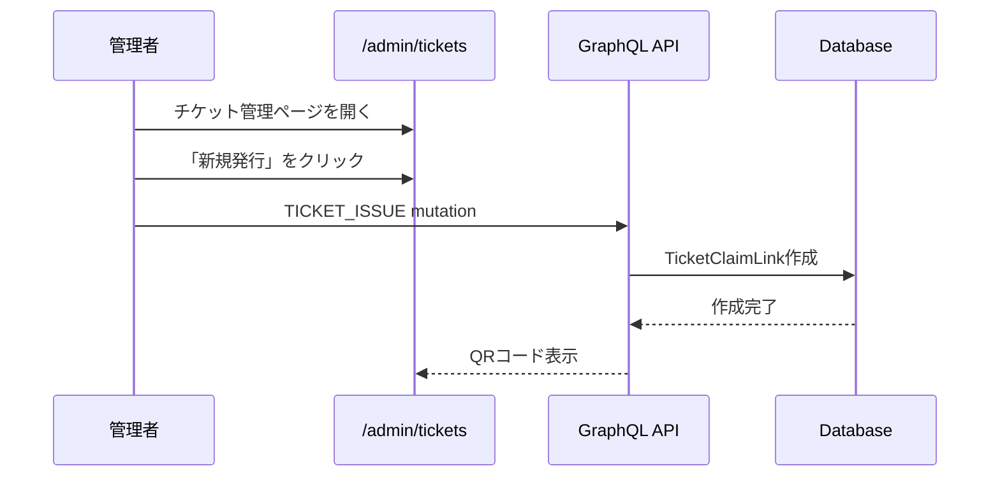
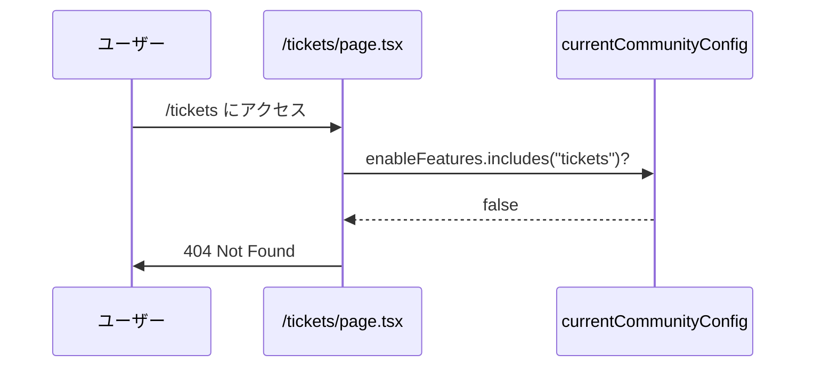
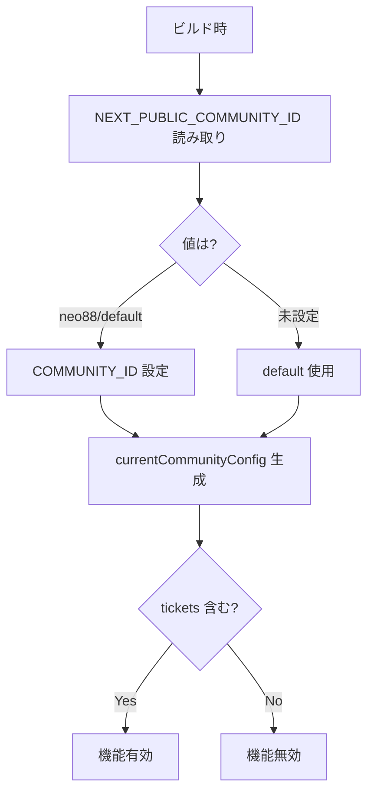

# チケット機能停止 要件定義書

**Document Version:** 1.2 (Final)
**作成日:** 2025-12-05
**最終更新:** 2025-12-05
**ステータス:** Ready for Implementation

---

## ステークホルダー

| 役割 | 氏名 | 責任範囲 |
|-----|------|---------|
| プロダクトオーナー | - | ビジネス要件の承認、優先順位決定 |
| テックリード | - | 技術的方針の承認、アーキテクチャレビュー |
| QAリード | - | テスト計画の承認、品質保証 |
| 開発担当 | - | 実装、単体テスト |
| 想定利用者 | 管理者、一般ユーザー | チケット機能の利用者（無効化後は利用不可） |

---

## 📋 目次

### 本編
1. [概要](#概要)
2. [目的とスコープ](#目的とスコープ)
3. [現状分析](#現状分析)
4. [要件定義](#要件定義)
5. [実装計画](#実装計画)
6. [テスト計画](#テスト計画)
7. [リスクと対策](#リスクと対策)

### 付録
- [付録A: 技術的前提条件](#付録a-技術的前提条件)
- [付録B: 調査結果とレビュー対応](#付録b-調査結果とレビュー対応)
- [付録C: システムフロー図](#付録c-システムフロー図)
- [付録D: 影響を受けるファイル一覧](#付録d-影響を受けるファイル一覧)
- [付録E: 実装パターン集](#付録e-実装パターン集)
- [付録F: トラブルシューティング](#付録f-トラブルシューティング)
- [付録G: 参考リンク](#付録g-参考リンク)
- [付録H: 変更履歴](#付録h-変更履歴)

---

# 本編

## 概要

### 背景

civicship-portalにおけるチケット関連機能を全面的に停止する。

### 対象コミュニティ

- `neo88`
- `default`

※これらのコミュニティで現在チケット機能が有効化されています

### 影響範囲

- ユーザー向けチケット機能（受け取り、一覧、使用）
- 管理者向けチケット管理機能（発行、Utility管理）
- 予約システムとの統合機能（チケット支払い）
- 検索機能のチケットフィルター

### ビジネス目標

- 使用しない機能の非表示によるUX向上
- 不要な機能の保守コスト削減
- 将来の再有効化を容易にする設計の維持

---

## 目的とスコープ

### 主目的

チケット関連機能を完全に無効化し、ユーザー・管理者ともにアクセスできないようにする

### スコープ

#### 実装対象 (In Scope)

- **Phase 1**: フィーチャーフラグの無効化（ナビゲーション自動非表示）
- **Phase 2**: ページレベルのアクセス制御（404エラー）
- **Phase 3**: 検索フィルターからのチケット項目削除

#### 実装対象外 (Out of Scope)

- データベースからのチケットデータ削除
- GraphQL APIの削除
- GraphQL クエリの tickets フィールド削除（再有効化を容易にするため）
- 予約確認画面の TicketsToggle コンポーネント修正（maxTickets=0 で自動非表示）

---

## 現状分析

### チケット機能の構成

#### ページ構成

**ユーザー向け:**
- `/tickets` - チケット一覧
- `/tickets/receive` - チケット受け取り

**管理者向け:**
- `/admin/tickets` - チケット管理一覧
- `/admin/tickets/[id]` - チケット詳細
- `/admin/tickets/utilities` - Utility管理

#### フィーチャーフラグ制御箇所（既存）

以下は既にフィーチャーフラグで制御されており、**変更不要**（自動非表示）:

| ファイル | 制御内容 |
|---------|---------|
| `AdminBottomBar.tsx` | 管理画面ナビゲーションタブ |
| `UserTicketsAndPoints.tsx` | プロフィールページのチケット表示 |
| `admin/page.tsx` | 管理設定ページのリンク |
| `PaymentSection.tsx` | 予約確認画面（maxTickets=0で自動非表示） |

---

## 要件定義

### 機能要件

#### FR-1: フィーチャーフラグ無効化

**要件:**
対象コミュニティ（`neo88`, `default`）の設定から `"tickets"` を削除

**受入基準:**
- [ ] metadata.ts の neo88/default から "tickets" が削除されている
- [ ] 管理画面ボトムバーにチケットタブが表示されない
- [ ] プロフィールページにチケット情報が表示されない

---

#### FR-2: ユーザー向けページのアクセス制御

**要件:**
チケット機能が無効な場合、ユーザー向けページを404エラーとする

**対象:**
- `/tickets/page.tsx`
- `/tickets/receive/page.tsx`

**受入基準:**
- [ ] `/tickets` にアクセスすると404エラー
- [ ] `/tickets/receive?token=xxx` にアクセスすると404エラー

---

#### FR-3: 管理画面ページのアクセス制御

**要件:**
チケット機能が無効な場合、管理画面ページを404エラーとする

**対象:**
- `/admin/tickets/page.tsx`
- `/admin/tickets/[id]/page.tsx`
- `/admin/tickets/utilities/page.tsx`

**受入基準:**
- [ ] `/admin/tickets` にアクセスすると404エラー
- [ ] `/admin/tickets/[id]` にアクセスすると404エラー
- [ ] `/admin/tickets/utilities` にアクセスすると404エラー

---

#### FR-4: 検索フィルターからのチケット項目削除

**要件:**
チケット機能が無効な場合、検索画面で「チケット利用可」フィルターを非表示

**対象:**
- `/src/app/search/components/SearchFilters.tsx`

**受入基準:**
- [ ] 検索画面で「チケット利用可」フィルターが表示されない
- [ ] ポイントフィルターは引き続き表示される

---

### 非機能要件

#### NFR-1: パフォーマンス
- ページ読み込み時間への影響: なし
- フィーチャーフラグチェックのオーバーヘッド: 1ms以下

#### NFR-2: 互換性
- 既存の他機能（ポイント、予約等）との互換性維持
- フィーチャーフラグが有効なコミュニティでは引き続き動作

#### NFR-3: 保守性
- 将来の再有効化を容易にする設計
- データベースデータは保持
- GraphQL クエリは保持（※理由は付録B参照）

#### NFR-4: セキュリティ
- 無効化されたページへの不正アクセス防止（404エラー）

---

## 実装計画

### Phase 1: フィーチャーフラグ無効化

**実装時間:** 5分
**優先度:** 🔴 最高

**変更ファイル:**
- `/src/lib/communities/metadata.ts`

**実装内容:**
```typescript
// Line 112付近 - neo88
enableFeatures: [
  "opportunities",
  "points",
  "articles",
  // "tickets", // ← 削除
  "prefectures",
  "quests"
]

// Line 311-319付近 - default
enableFeatures: [
  "opportunities",
  "places",
  "points",
  "articles",
  // "tickets", // ← 削除
  "prefectures",
  "quests"
]
```

**検証:**
- 管理画面でチケットタブが非表示
- プロフィールページでチケット情報が非表示

---

### Phase 2: ページレベルのアクセス制御

**実装時間:** 30分
**優先度:** 🟡 高

**変更ファイル:**
1. `/src/app/tickets/page.tsx`
2. `/src/app/tickets/receive/page.tsx`
3. `/src/app/admin/tickets/page.tsx`
4. `/src/app/admin/tickets/[id]/page.tsx`
5. `/src/app/admin/tickets/utilities/page.tsx`

**実装パターン（全ページ共通）:**
```typescript
import { currentCommunityConfig } from "@/lib/communities/metadata";
import { notFound } from "next/navigation";

export default function TicketsPage() {
  if (!currentCommunityConfig.enableFeatures.includes("tickets")) {
    notFound();
  }

  // 既存の実装...
}
```

**検証:**
- 各URLにアクセスして404エラーが表示される

---

### Phase 3: 検索フィルターの無効化

**実装時間:** 20分
**優先度:** 🟢 中

**変更ファイル:**
- `/src/app/search/components/SearchFilters.tsx`

**実装内容:**

```typescript
// ファイル先頭に import 追加
import { currentCommunityConfig } from "@/lib/communities/metadata";

const SearchFilters: React.FC<SearchFiltersProps> = ({
  onFilterClick,
  formatDateRange,
  prefectureLabels,
  location,
  dateRange,
  guests,
  useTicket,
  usePoints,
}) => {
  const { control } = useFormContext();

  // Feature flag チェック
  const isTicketsEnabled = currentCommunityConfig.enableFeatures.includes("tickets");

  return (
    <div className="bg-background rounded-xl overflow-hidden">
      {/* 場所・日付・人数フィルター */}
      <FormField ... />
      <FormField ... />
      <FormField ... />

      {/* その他の条件 - チケット機能が無効でもポイントがあれば表示 */}
      {(isTicketsEnabled || usePoints) && (
        <FormField
          control={control}
          name="useTicket"
          render={() => (
            <FormItem>
              <FormControl>
                <FilterButton
                  icon={<Tags className="h-4 w-4" />}
                  label="その他の条件"
                  value=""
                  active={useTicket}
                  onClick={() => onFilterClick("other")}
                  verticalLayout={true}
                  className="rounded-b-xl"
                >
                  {[
                    isTicketsEnabled && useTicket && "チケット利用可",
                    usePoints && "ポイント利用可"
                  ]
                    .filter(Boolean)
                    .join(",")}
                </FilterButton>
              </FormControl>
            </FormItem>
          )}
        />
      )}
    </div>
  );
};
```

**検証:**
- 検索画面で「チケット利用可」フィルターが非表示
- ポイントフィルターは表示される

---

### ロールバック計画

各Phaseは独立しており、個別にロールバック可能：

**Phase 1:** metadata.ts で "tickets" を戻す（1分）
**Phase 2:** notFound() チェックを削除（10分）
**Phase 3:** SearchFilters の条件分岐を削除（5分）

---

## テスト計画

### テストシナリオ

#### TS-1: フィーチャーフラグ無効化

| ID | 操作 | 期待結果 | 優先度 |
|----|------|---------|--------|
| TC-1.1 | 管理画面を開く | チケットタブが非表示 | P0 |
| TC-1.2 | プロフィールページを開く | チケット情報が非表示 | P0 |

#### TS-2: ページアクセス制御

| ID | 操作 | 期待結果 | 優先度 |
|----|------|---------|--------|
| TC-2.1 | /tickets にアクセス | 404エラー | P0 |
| TC-2.2 | /admin/tickets にアクセス | 404エラー | P0 |

#### TS-3: 検索機能

| ID | 操作 | 期待結果 | 優先度 |
|----|------|---------|--------|
| TC-3.1 | 検索画面を開く | チケットフィルター非表示 | P0 |
| TC-3.2 | ポイントフィルター確認 | 正常に表示・動作 | P0 |

#### TS-4: リグレッション

| ID | 操作 | 期待結果 | 優先度 |
|----|------|---------|--------|
| TC-4.1 | ポイントで予約作成 | 正常に完了 | P0 |
| TC-4.2 | 現金で予約作成 | 正常に完了 | P0 |

---

## リスクと対策

| ID | リスク | 影響度 | 発生確率 | 対策 |
|----|--------|--------|---------|------|
| R-1 | Phase 1のみ実施時、URL直接アクセス可能 | 中 | 高 | Phase 2を必ず実施 |
| R-2 | 他機能への影響 | 高 | 低 | 十分なリグレッションテスト |
| R-3 | 実装漏れ | 中 | 低 | コードレビューで全箇所確認 |

---

# 付録

## 付録A: 技術的前提条件

### A-1. コミュニティ設定システム

**仕組み:**
```typescript
// 環境変数 NEXT_PUBLIC_COMMUNITY_ID でビルド時に決定
export const COMMUNITY_ID = getCommunityIdFromEnv();
export const currentCommunityConfig = COMMUNITY_BASE_CONFIG[COMMUNITY_ID];
```

**重要:** コミュニティIDはビルド時に固定され、ランタイムでは変更されない（動的切り替えなし）

---

### A-2. フィーチャーフラグシステム

**定義:**
```typescript
type FeaturesType = "places" | "opportunities" | "points" | "tickets" | ...;

interface CommunityBaseConfig {
  id: string;
  enableFeatures: FeaturesType[];
}
```

**使用パターン:**
```typescript
// 条件付きレンダリング
{currentCommunityConfig.enableFeatures.includes("tickets") && <Component />}

// 404エラー
if (!currentCommunityConfig.enableFeatures.includes("tickets")) {
  notFound();
}
```

---

### A-3. GraphQL クエリの扱い

#### なぜ tickets フィールドを削除しないのか

**理由:**

1. **再有効化の容易性**
   フィーチャーフラグの切り替えのみで再有効化可能

2. **Codegen への影響**
   tickets フィールドを削除すると、Apollo Client の型生成（GraphQL Code Generator）に影響し、型の不整合が発生する可能性がある

3. **キャッシュとスキーマの一貫性**
   Apollo Client のキャッシュ正規化において、フィールドの存在が前提となっている箇所がある可能性

4. **パフォーマンス影響は軽微**
   tickets は通常0-10件程度で、データ取得のオーバーヘッドは無視できるレベル

**現状維持するクエリ:**
```typescript
// /src/graphql/account/wallet/query.ts
export const GET_WALLETS_WITH_TICKET = gql`
  query GetWalletsWithTicket(...) {
    wallets(...) {
      edges {
        node {
          ...WalletFields
          tickets {              # ← 残す
            ...TicketFields
          }
        }
      }
    }
  }
`;
```

---

### A-4. 予約確認画面の構成

**現状:**
`/reservation/confirm/page.tsx` は全体が Client Component ("use client")

**将来の可能性:**
将来的に Server Component 化する可能性がある。その場合、フィーチャーフラグの参照を上位層（page.tsx）で行い、props として渡す構成も検討可能。

**現在の実装方針:**
既存の条件分岐（`maxTickets > 0`）により自動的に TicketsToggle が非表示になるため、追加実装は不要。

---

### A-5. Next.js App Router の構成

**Server Component と Client Component:**

| タイプ | 実行場所 | 特徴 |
|--------|---------|------|
| Server Component | サーバー | ビルド時に `currentCommunityConfig` が評価される |
| Client Component | ブラウザ | "use client" ディレクティブが必要 |

**本プロジェクトの構成:**

| ページ/コンポーネント | タイプ |
|-------------------|--------|
| `/tickets/page.tsx` | Server |
| `/admin/tickets/page.tsx` | Server |
| `/reservation/confirm/page.tsx` | Client |
| `SearchFilters.tsx` | Client |

---

## 付録B: 調査結果とレビュー対応

### B-1. コードベース調査結果

| 項目 | 調査結果 |
|------|---------|
| コミュニティ判定 | 環境変数 `NEXT_PUBLIC_COMMUNITY_ID` で静的決定 |
| currentCommunityConfig | ビルド時に固定、ランタイム変更なし |
| GraphQL クエリ | `GET_WALLETS_WITH_TICKET` で tickets 取得 |
| 予約画面構成 | 全体が Client Component |
| 検索フィルター | 5つのレイヤーで連携 |

### B-2. レビュー指摘への対応

#### 指摘1: currentCommunityConfig の動的性

**指摘内容:** URL/Cookie/ドメインによる動的切り替えの可能性
**調査結果:** ビルド時に固定、動的切り替えなし
**結論:** ✅ この懸念は該当しない

#### 指摘2: Client Component での扱い

**指摘内容:** ビルド時の値が固定される可能性
**調査結果:** NEXT_PUBLIC_ 環境変数はビルド時埋め込み（意図された動作）
**結論:** ✅ 直接 import 可能

#### 指摘3: GraphQL フィールドの最適化

**指摘内容:** tickets フィールド取得の可能性
**調査結果:** `GET_WALLETS_WITH_TICKET` で取得している
**対応:** ✅ 再有効化考慮でクエリは保持（付録A-3参照）

#### 指摘4: 検索フィルター実装箇所

**指摘内容:** 該当箇所調査が未完了
**調査結果:** `SearchFilters.tsx` (L94-115) を特定
**結論:** ✅ 実装箇所特定済み

---

## 付録C: システムフロー図

### C-1. チケット発行フロー（現状）



### C-2. 無効化後のページアクセスフロー



### C-3. フィーチャーフラグチェックフロー



---

## 付録D: 影響を受けるファイル一覧

### D-1. 変更が必要なファイル

**Phase 1:**
- `/src/lib/communities/metadata.ts` (L112, L311-319)

**Phase 2:**
- `/src/app/tickets/page.tsx`
- `/src/app/tickets/receive/page.tsx`
- `/src/app/admin/tickets/page.tsx`
- `/src/app/admin/tickets/[id]/page.tsx`
- `/src/app/admin/tickets/utilities/page.tsx`

**Phase 3:**
- `/src/app/search/components/SearchFilters.tsx` (L94-115)

### D-2. 自動的に影響を受けるファイル（変更不要）

- `/src/components/layout/AdminBottomBar.tsx` (L53-60)
- `/src/app/users/features/profile/components/UserTicketsAndPoints.tsx` (L61-65)
- `/src/app/admin/page.tsx` (L37-42, L76-80)
- `/src/app/reservation/confirm/components/payment/PaymentSection.tsx` (L101-114)

### D-3. 変更しないファイル

- `/src/graphql/account/wallet/query.ts` - GraphQLクエリ（理由は付録A-3参照）
- `/src/app/reservation/confirm/hooks/useWalletData.ts`

---

## 付録E: 実装パターン集

### E-1. Server Component でのページアクセス制御

```typescript
import { currentCommunityConfig } from "@/lib/communities/metadata";
import { notFound } from "next/navigation";

export default function TicketsPage() {
  if (!currentCommunityConfig.enableFeatures.includes("tickets")) {
    notFound();
  }
  return <div>チケット一覧</div>;
}
```

### E-2. Client Component での条件付きレンダリング

```typescript
"use client";
import { currentCommunityConfig } from "@/lib/communities/metadata";

export function SearchFilters() {
  const isTicketsEnabled = currentCommunityConfig.enableFeatures.includes("tickets");

  return (
    <div>
      {isTicketsEnabled && <FilterButton label="チケット利用可" />}
    </div>
  );
}
```

---

## 付録F: トラブルシューティング

### F-1. Phase 1 実装後もチケットタブが表示される

**原因:** ビルドキャッシュが残っている

**対処:**
```bash
rm -rf .next
npm run dev
```

### F-2. 404エラーではなく、ページが表示される

**原因:** Phase 2 の実装漏れ

**確認:**
```typescript
// インポートがあるか
import { notFound } from "next/navigation";

// notFound() の呼び出しがあるか
if (!currentCommunityConfig.enableFeatures.includes("tickets")) {
  notFound();
}
```

### F-3. 検索フィルターが完全に消える

**原因:** ポイントフィルターも非表示にしている

**正しい実装:**
```typescript
// ✅ 正しい
{(isTicketsEnabled || usePoints) && <FormField ... />}

// ❌ 間違い
{isTicketsEnabled && <FormField ... />}
```

---

## 付録G: 参考リンク

**内部:**
- GraphQLスキーマ: `/src/graphql/reward/`
- コミュニティ設定: `/src/lib/communities/metadata.ts`

**外部:**
- Next.js App Router: https://nextjs.org/docs/app
- Next.js notFound: https://nextjs.org/docs/app/api-reference/functions/not-found
- Apollo Client: https://www.apollographql.com/docs/react/

---

## 付録H: 変更履歴

| バージョン | 日付 | 変更内容 | 作成者 |
|----------|------|---------|--------|
| 1.0 | 2025-12-05 | 初版作成 | Claude |
| 1.1 | 2025-12-05 | レビュー指摘反映（前提条件・調査結果・フロー図追加） | Claude |
| 1.2 | 2025-12-05 | 最終版（本編スリム化、ステークホルダー追加、GraphQL説明強化） | Claude |

---

## 承認

| 役割 | 氏名 | 承認日 | 署名 |
|-----|------|--------|------|
| プロダクトオーナー | | | |
| テックリード | | | |
| QAリード | | | |

---

**END OF DOCUMENT**

---

## 📌 実装者へのメッセージ

本要件定義書 Ver1.2 は以下の点を重視して作成しました：

1. **本編のスリム化**: 実装に必要な最小情報のみに絞り込み
2. **詳細情報の分離**: 技術的背景は付録に移動し、必要に応じて参照可能
3. **実装の具体性**: 各Phase の変更箇所を明確に記載
4. **保守性の確保**: 再有効化を容易にする設計

不明点があれば、まず付録Aの技術的前提条件を参照してください。
