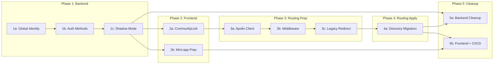

# Multi-Tenant Migration Overview

## 目的

本移行は以下の2つの目標を達成する：

1. **インフラ統合**: コミュニティごとの Cloud Run インスタンスから、単一の統合インスタンスへの移行
2. **LINE ミニアプリ対応**: LIFF アプリから LINE ミニアプリへの移行対応

※ これらは技術的には分割可能だが、本計画では統合的に実施する。

## 背景

### communityId: null の経緯

これまで各コミュニティは異なるプロバイダーで LINE ログインチャネル・Messaging API を作成していた。同一プロバイダーで作成するように変更したことで、LINE の uid がプロバイダー単位で一意となり、コミュニティ間で uid が重複する可能性が生じた。

この問題を解決するため、統合チャネル用の Identity は `communityId: null`（グローバル Identity）として管理する設計を採用した。

### 設計判断: communityId: null を選択した理由

**採用理由**:
1. 既存の Identity テーブル構造を維持しつつ、グローバル Identity を表現可能
2. 新テーブル追加によるスキーマ複雑化を回避
3. 既存クエリロジックとの互換性（null 許容で段階移行可能）
4. 移行期間中の旧ロジック（communityId 指定）と新ロジック（null）の共存が容易

**検討した代替案**:

| 案 | 不採用理由 |
|----|-----------|
| 別テーブル（GlobalIdentity） | スキーマ変更が大きく、移行リスク増大 |
| type 列追加（GLOBAL/COMMUNITY） | 既存データのマイグレーションが必要 |
| 別フィールド（globalUserId） | アプリ層の変更箇所が多い |

### 調査項目

- [ ] 同一プロバイダーなら Messaging API は1つでも良いのか調査が必要

## 現状のアーキテクチャ

- Frontend: コミュニティごとに別々の Cloud Run インスタンス
- Backend: 単一インスタンス（X-Community-Id ヘッダーでコミュニティを識別）
- 認証: コミュニティごとの LIFF チャネル

※ dev環境では epic/mini-appify ブランチで統合インスタンスが稼働中（インフラ設定は未検証、エラーが存在）

## 目標のアーキテクチャ

- Frontend: 単一の Cloud Run インスタンス
- Backend: 単一インスタンス（変更なし）
- 認証: 統合チャネル（LINE ミニアプリ + LIFF 両対応、communityId: null）
- ルーティング: URL パスベース（例: `/neo88/activities`）

## 統合インスタンスでのミニアプリ移行の必要条件

以下の条件をすべて満たすことで、統合インスタンスでのミニアプリ移行が実現可能となる。

| # | 必要条件 | 説明 | 対応 PR |
|---|----------|------|---------|
| 1 | グローバル Identity 対応 | communityId: null の Identity をサポートし、同一プロバイダーでの uid 重複問題を解決 | PR 1a |
| 2 | 統合 LIFF チャネル認証 | 統合チャネルからのログインをサポートする新認証メソッド追加 | PR 1b |
| 3 | 認証シャドウモード | 本番環境で安全に新認証ロジックを検証可能にする | PR 1c |
| 4 | URL パスベースのコミュニティ識別 | communityId を URL パスから抽出し、CommunityLink で自動付与 | PR 2a |
| 5 | Mini-app 403 エラー対策 | profile スコープの権限確保（準備: PR 2b、有効化: PR 5b） | PR 2b, 5b |
| 6 | Apollo Client の動的 communityId 対応 | URL パスから communityId を抽出してヘッダーに設定 | PR 3a |
| 7 | Middleware の新ルーティング対応 | 新旧両方の URL 構造をサポート | PR 3b |
| 8 | レガシー URL リダイレクト | 旧 URL から新 URL への自動リダイレクト | PR 3c |
| 9 | ディレクトリ構造の変更 | ページを [communityId] ディレクトリに移動 | PR 4a |
| 10 | CI/CD 単一デプロイ化 | Matrix ビルドから単一デプロイへ移行 | PR 5b |
| 11 | 環境変数フォールバック削除 | パスベースの communityId 取得のみに統一 | PR 5b |

## PR 分割戦略

### Phase 1: Backend 基盤（破壊的変更なし）

| PR | 内容 | リスク |
|----|------|--------|
| 1a | グローバル Identity 基盤 + DB マイグレーション | 低 |
| 1b | 新認証メソッド追加 | 低 |
| 1c | Firebase Auth シャドウモード | 低 |

### Phase 2: Frontend 基盤（ルーティング非依存）

| PR | 内容 | リスク |
|----|------|--------|
| 2a | ユーティリティ追加（CommunityLink, extractCommunityIdFromPath） | 低 |
| 2b | Mini-app 403 エラー対策（ensureProfilePermission） | 低 |

### Phase 3: ルーティング準備（コード追加のみ、未適用）

| PR | 内容 | リスク |
|----|------|--------|
| 3a | Apollo Client 準備（環境変数フォールバック付き） | 低 |
| 3b | Middleware 準備（新旧両方のパスをサポート） | 低 |
| 3c | レガシー URL リダイレクト準備 | 低 |

### Phase 4: ルーティング適用（ディレクトリ移動）

| PR | 内容 | リスク |
|----|------|--------|
| 4a | ページを `[communityId]` ディレクトリに移動 | 中 |

### Phase 5: クリーンアップ + インフラ

| PR | 内容 | リスク |
|----|------|--------|
| 5a | Backend クリーンアップ（シャドウモード削除） | 低 |
| 5b | Frontend クリーンアップ + CI/CD 単一デプロイ + 認証完全移行 | 高 |

## 依存関係

### PR 依存関係図



### フェーズ間の依存関係

```
Phase 1 (Backend)
  PR 1a → PR 1b → PR 1c
              ↓
Phase 2 (Frontend)
  PR 2a, PR 2b（並行可能）
              ↓
Phase 3 (Routing Prep)
  PR 3a → PR 3b → PR 3c
              ↓
Phase 4 (Routing Apply)
  PR 4a
    ↓
Phase 5 (Cleanup)
  PR 5a + PR 5b（一括デプロイ必須）
```

## シャドウモードの動作

### Backend（PR 1c）

```
NODE_ENV=production:
  1. 旧ロジック実行 → 結果を返す（安全）
  2. 新ロジック実行 → ログに記録（検証用）
  3. 差分があればアラート

NODE_ENV=development:
  新ロジックのみ実行
```

### 比較ログフォーマット

```json
{
  "level": "info",
  "message": "[ShadowMode] Auth comparison",
  "context": {
    "operation": "identityResolution",
    "match": true,
    "old": { "userId": "xxx", "identityId": "yyy" },
    "new": { "userId": "xxx", "identityId": "zzz" }
  }
}
```

### シャドウモード成功基準

Phase 5a（Backend クリーンアップ）に進む前に、以下の基準をすべて満たす必要がある。

**観察要件**:
- 観察期間: 最低 1-2 週間
- サンプル数: 各認証フロー 100 件以上
- 差分率: 0.1% 未満（エッジケースを除く）

**必須確認項目**:
- [ ] Global Identity 検索の一致率: 99.9% 以上
- [ ] Membership 自動作成の成功率: 99.9% 以上
- [ ] 認証トークンの整合性: 100%
- [ ] エラー発生率: 旧ロジックと同等以下

**許容されるエッジケース**:
- 移行期間中に作成された新規ユーザー（旧ロジックで Identity が存在しない）
- テスト用アカウント

**判定プロセス**:
1. Cloud Logging でシャドウモードログを集計
2. 差分が発生したケースを個別に調査
3. エッジケース以外の差分がゼロであることを確認
4. チームでレビューし、Phase 5a 移行を承認

## ロールバック戦略

### Phase 1-3

- 各 PR は独立してロールバック可能
- 旧ロジックが維持されているため、PR を revert するだけで復旧

### Phase 4

- ディレクトリ構造の変更は revert で復旧可能
- ただし、Phase 3 の準備コードが残っていれば影響なし

### Phase 5

Phase 5 は CI/CD と LIFF 設定が同時に変更されるため、ロールバック手順が複雑になる。

#### PR 5a (Backend) ロールバック手順

1. `git revert` でシャドウモードコードを復元
2. デプロイ後、シャドウモードを再有効化
3. 影響範囲: Backend のみ、Frontend への影響なし

#### PR 5b (Frontend + CI/CD) ロールバック手順

**即座に必要な対応**:
1. Cloud Run: 前バージョンのリビジョンにトラフィックを 100% 切り替え
   ```bash
   gcloud run services update-traffic civicship-portal \
     --to-revisions=PREVIOUS_REVISION=100 \
     --region=asia-northeast1
   ```

**コード復旧**:
1. 環境変数フォールバックを復元（`apollo.ts`, `middleware.ts`）
2. Matrix ビルドを復元（`.github/workflows/deploy-to-cloud-run-prod.yml`）
3. `ensureProfilePermission()` を無効化

**LIFF 設定**:
1. 統合 LIFF チャネルから各コミュニティ LIFF へ戻す
2. LINE Developers Console で Endpoint URL を変更

**注意事項**:
- Phase 5b のロールバックは複雑なため、十分な検証期間（最低 1 週間）を設けてから実行
- ロールバック時は、新規ユーザーのデータ整合性に注意（Global Identity で作成されたユーザー）

## 運用手順

### 新コミュニティ追加時の手順

統合インスタンス移行後、新しいコミュニティは管理画面から作成可能。

**手順**:
1. 管理画面にアクセス
2. コミュニティ作成フォームから必要情報を入力
3. 作成ボタンをクリック

**自動的に設定される項目**:
- Backend: `t_community_configs`、`t_community_line_configs` への DB レコード追加
- 統合 LIFF チャネルの設定（`INTEGRATED_LIFF_ID` を使用）

**注意事項**:
- Edge Runtime では DB アクセスができないため、Middleware でのコミュニティ検証は `config-env.ts` のハードコード設定に依存
- 新コミュニティを Middleware で認識させるには、`config-env.ts` への追加と Frontend デプロイが必要
- 将来的には、コミュニティ一覧を API から取得してキャッシュする仕組みへの移行を検討

## テスト計画

### E2E テストシナリオ

**認証フロー**:
- [ ] LINE ミニアプリからの新規ユーザー登録
- [ ] LINE ミニアプリからの既存ユーザーログイン
- [ ] LIFF ブラウザからのログイン
- [ ] 複数コミュニティ間でのユーザー切り替え

**ルーティング**:
- [ ] 新 URL（`/neo88/activities`）でのページ表示
- [ ] 旧 URL（`/activities`）からのリダイレクト
- [ ] CommunityLink による正しい URL 生成
- [ ] 存在しないコミュニティへのアクセス時のエラーハンドリング

**API**:
- [ ] GraphQL リクエストの X-Community-Id ヘッダー付与
- [ ] Webhook での communityId 取得

### 負荷テスト計画

**目的**: 単一インスタンス化による影響を評価

**テスト項目**:
- 同時接続数: 現在の全コミュニティ合計の 1.5 倍
- レスポンスタイム: 95 パーセンタイルで 500ms 以下
- エラー率: 0.1% 以下

**実施タイミング**: Phase 5b デプロイ前（dev 環境で実施）

## 参照情報

### epic/mini-appify ブランチ

- Portal: https://github.com/Hopin-inc/civicship-portal/tree/epic/mini-appify
- API: https://github.com/Hopin-inc/civicship-api/tree/epic/mini-appify

### 関連 PR

- Portal PR #909: https://github.com/Hopin-inc/civicship-portal/pull/909
- API PR #620: https://github.com/Hopin-inc/civicship-api/pull/620
